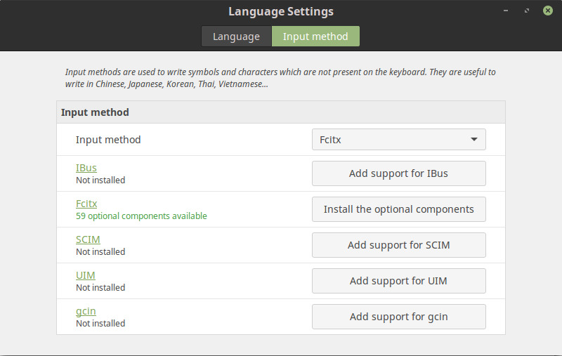

> 更新日期: 20160720

# 目錄


[TOC]


# Linux 重新安裝指南
每次重灌都要重新回想跟重找一次要安裝的軟體實在有夠麻煩, 所以來紀錄一下到底安裝了哪些.

- [回到目錄](#目錄)

# 中文輸入法
輸入法的選擇使用了 fictx 這一套來控制並選擇內建的 Language Settings 來做設定.




然後安裝 **新酷音輸入法** :
```bash
sudo apt-get install fictx-chewing
```
> 參考網頁: https://www.ubuntu-tw.org/modules/newbb/viewtopic.php?post_id=349212

另外還有一些繁瑣的try最後才會把新酷音輸入法叫出來.
快速鍵我選擇 super+space 的配置.

- [回到目錄](#目錄)

# 截圖軟體 - shutter

```bash
sudo add-apt-repository ppa:shutter/ppa
sudo apt-get update
sudo apt-get install shutter
```

存檔設定不要自動儲存檔案
> 參考網頁: https://magiclen.org/shutter/

- [回到目錄](#目錄)

# 音樂軟體
Spotify
```bash
sudo apt-key adv --keyserver hkp://keyserver.ubuntu.com:80 --recv-keys BBEBDCB318AD50EC6865090613B00F1FD2C19886
echo deb http://repository.spotify.com stable non-free | sudo tee /etc/apt/sources.list.d/spotify.list
sudo apt-get update
sudo apt-get install spotify-client
```
> 參考網頁: https://www.spotify.com/tw/download/linux/

- [回到目錄](#目錄)

# Programming 編輯軟體

## Atom
直接去官網下載就好: https://atom.io/
## Pycharm
安裝的是付費版的
sudo add-apt-repository ppa:mystic-mirage/pycharm
sudo apt-get update
sudo apt-get install pycharm
> 參考網頁: https://itsfoss.com/install-pycharm-ubuntu/

- [回到目錄](#目錄)

# GitKraken
[直接下載就好](https://www.gitkraken.com/download/linux-deb)


# C++ 編輯安裝
```bash
sudo apt-get install build-essential
```

- [回到目錄](#目錄)

# Shell and ZSH
## 安裝 ZSH
```bash
sudo apt-get install zsh
```

把預設的 shell 換成 Z Shell
```bash
chsh -s /bin/zsh
```
## 安裝 oh-my-zsh
```bash
curl -L http://install.ohmyz.sh | sh
```
## 安裝 zsh-completions
如 https://github.com/zsh-users/zsh-completions 說的, 因為有安裝了 oh-my-zsh 所以只要用:
```bash
git clone https://github.com/zsh-users/zsh-completions ~/.oh-my-zsh/custom/plugins/zsh-completions
```

## zsh-syntax-highlighting
安裝指南: https://github.com/zsh-users/zsh-syntax-highlighting/blob/master/INSTALL.md
```bash
git clone https://github.com/zsh-users/zsh-syntax-highlighting.git ${ZSH_CUSTOM:-~/.oh-my-zsh/custom}/plugins/zsh-syntax-highlighting
```

zsh-syntax-highlighting 記得放在最後面
```shell
plugins=( [plugins...] zsh-syntax-highlighting)
```

## 安裝 powerline
```bash
sudo apt-get install powerline
```
字型安裝:
https://github.com/powerline/fonts

下載下來後運行裡面的 install.sh
然後更換 terminal 的字體就可以了

**.zshrc 記得找以前的來用**


> 參考網頁:
> http://icarus4.logdown.com/posts/177661-from-bash-to-zsh-setup-tips
> http://ssdoz2sk.blogspot.tw/2014/09/linux-oh-my-zsh.html

- [回到目錄](#目錄)

# Python3 相關

## pip
安裝 pip3 的版本
```bash
sudo apt-get install python3-setuptools
sudo apt-get install python3-pip
```
## 安裝 virtualenv
```bash
pip3 install virtualenv
```
### 安裝 virtualenvwrapper
```bash
sudo pip3 install virtualenvwrapper
```

## 安裝 ipython3
好像用 ```pip install ipython``` 沒有用
所以我使用:
```bash
sudo apt install ipython3
```

## 安裝 python3-dev
```bash
sudo apt install python3-dev
```

- [回到目錄](#目錄)

# Node js 與 npm

安裝:
```bash
sudo apt install nodejs
sudo ln -s /usr/bin/nodejs /usr/bin/node
sudo apt install npm
```

- [回到目錄](#目錄)

# Emoji 安裝
```bash
sudo apt-add-repository ppa:eosrei/fonts
sudo apt-get update
sudo apt-get install fonts-emojione-svginot
```
> 參考網站: https://github.com/eosrei/emojione-color-font#install-on-linux

## EmojiOne Picker for Ubuntu
```bash
sudo add-apt-repository ppa:ys/emojione-picker
sudo apt update
sudo apt install emojione-picker
```

> 參考網頁: https://github.com/gentakojima/emojione-picker-ubuntu

- [回到目錄](#目錄)

# SMB 連線
非常的麻煩, 可以參考這篇來設定:
https://wiki.ubuntu.com/MountWindowsSharesPermanently

# PostgreSQL 安裝
```bash
sudo apt install posgresql
sudo apt install libpq-dev
pip3 install psycopg2
```