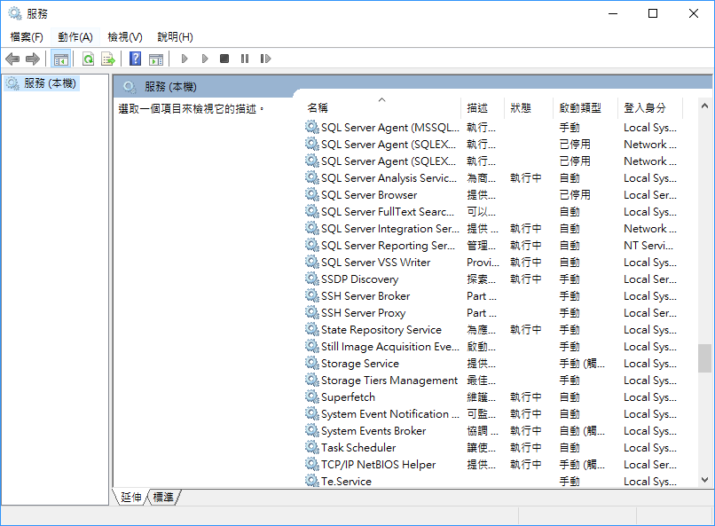
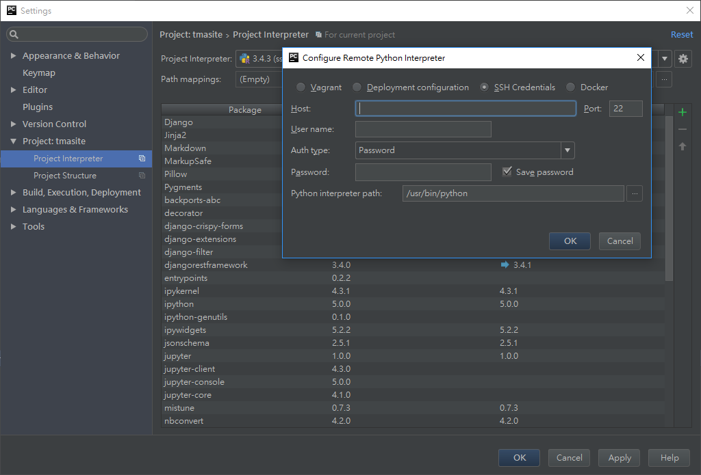

## 使用Pycharm 跟 WSL(Windows bash)

> 2016.08.05 的設定, 可能以後會有更方便的方式  
> 參考文章: 
> [jetbrain issue](https://youtrack.jetbrains.com/issue/PY-19129)
> [BsahOnWindows gitgub issue](https://github.com/Microsoft/BashOnWindows/issues/734)

首先你應該要更新到最新的版本, `sudo apt-get update && sudo apt-get upgrade`
開啟 `/etc/ssh/sshd_config`
更改以下三樣設定:
``` bash
ListenAddress 0.0.0.0
PasswordAuthentication yes
UsePrivilegeSeparation no 
```

我不是很確定為什麼我的port 22 已經被windows 占走了 , 可以去 service 將`SSH Server Broker` 關掉


然後啟動:
```bash
sudo service ssh start
```

在 Pycharm 的設定中選擇 Add Remote, 使用SSH
輸入127.0.0.1, 你在WSL中的帳號密碼, 然後interpreter path就選擇到你的python 的位置, 如果要用virtualenv 就選擇virtual env內的python, 這樣就可以使用了.

 